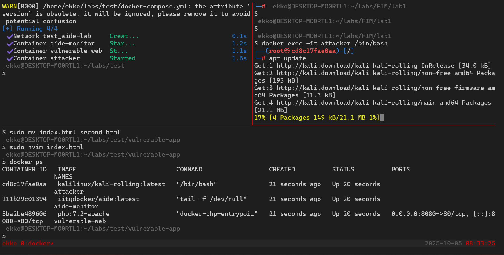
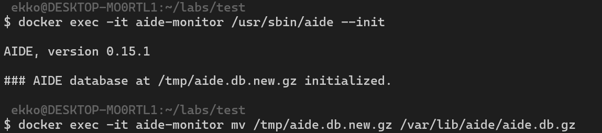
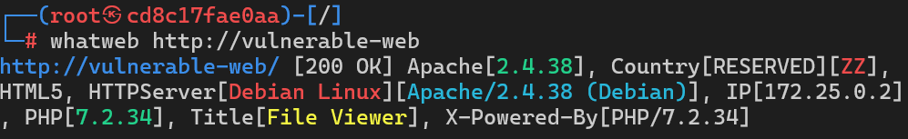
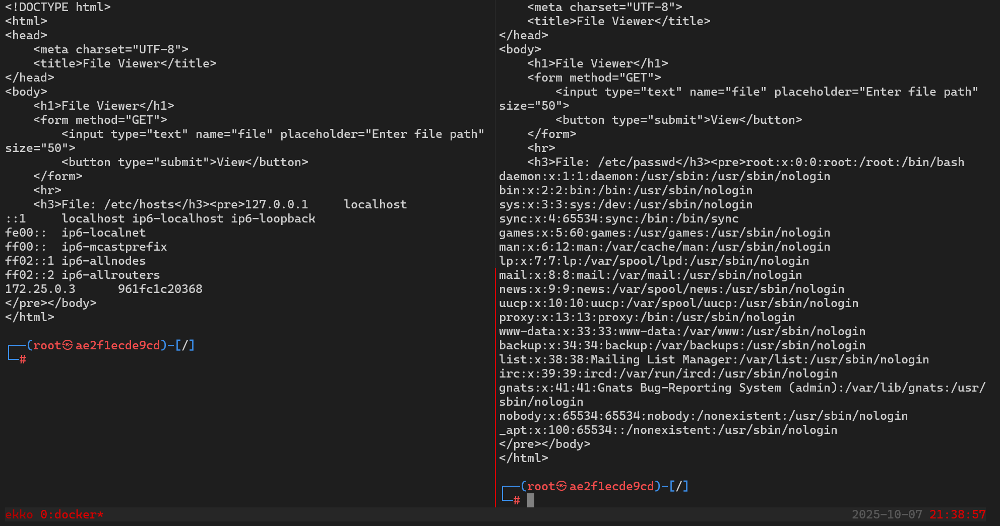
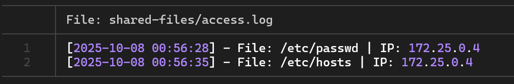

# Introduccion
El laboratorio consta de varios contenedores en docker.
El contenedor principal monitoreara la web mientras que el contenedor con kali atacara la web.

```
┌──────────--┐                ┌──────────────┐              ┌──────────────┐
│ Attacker   │   HTTP GET     │ vulnerable-  │   Escribe    │    AIDE      │
│            │──────────────▶│     web      │─────────────▶│   Monitor    │
│172.20.0.30 │ ?file=/etc/    │ 172.20.0.10  │  access.log  │ 172.20.0.20  │
└──────────--┘   passwd       └──────────────┘              └──────────────┘
                                     │                            │
                                     │                            │
                                     ▼                            ▼
                              Genera Log               Detecta Cambio
                              access.log                en checksum
                                     │                            │
                                     └────────────────────────────┘
                                              Alerta
```

## ¿Qué es AIDE?

AIDE (Advanced Intrusion Detection Environment) es un sistema de detección de intrusiones basado en host (HIDS) que utiliza técnicas de File Integrity Monitoring para detectar cambios no autorizados en el sistema de archivos.

**Características principales:**

- Cálculo de checksums criptográficos (MD5, SHA1, SHA256)
- Monitoreo de permisos, propietarios y timestamps
- Base de datos de referencia (baseline)
- Reportes detallados de cambios
- Open source y gratuito

## ¿Qué es FIM?

File Integrity Monitoring (FIM) es una técnica de seguridad que:

1. **Crea un baseline**: "Fotografía" del estado inicial del sistema
2. **Calcula checksums**: Hashes criptográficos de cada archivo
3. **Compara estados**: Contrasta el estado actual vs el baseline
4. **Genera alertas**: Notifica cuando detecta cambios

# Despliegue


Para el despliegue se creo un docker-compose. Este contiene las imagenes requeridas, volumenes y el resto de la informacion.

# Despliegue
``` bash
    # Crear subdirectorios
    mkdir -p vulnerable-app
    mkdir -p aide-config
    mkdir -p aide-data
    mkdir -p shared-files

    #Despliegue de el lab
    docker-compose up -d
```
## Nota:
Se recomienda asignar permisos especificos a el director de los logs para evitar problemas al escribir los logs (chmod 777 shared-files/)

# Configuracion
``` bash
    # crear archivo de configuracion
    cat > aide-config/aide.conf << 'EOF'
    @@define DBDIR /var/lib/aide
    database=file:@@{DBDIR}/aide.db.gz
    database_out=file:@@{DBDIR}/aide.db.new.gz
    gzip_dbout=yes
    verbose=5
    FULL  = R+L+n+u+g+s+md5+sha256+m+c
    /monitored-logs FULL
    EOF
```

``` bash
    #Iniciar el servicio de aide dentro de el contenedor
    docker exec -it aide-monitor /usr/sbin/aide --init

    #renombrar el archivo aide.db.gz
    docker exec -it aide-monitor mv /tmp/aide.db.new.gz /var/lib/aide/aide.db.gz
```


# Pruebas
Dentro de el lab se realizaron varias pruebas para confirmar la funcionalidad de aide.
Desde el contenedor de kali se realizo una inspeccion con whatweb



Usando ataques desde kali se logro vulnerar la pagina con un LFI.
Logrando leer archivos delicados de el sistema victima, usando la web vulnerable como medio de inyeccion para el payload.

``` bash
    #Instalacion de recursos
    docker exec attacker bash -c "apt update && apt install -y curl"

    #pruebas de penetracion
    docker exec attacker curl "http://vulnerable-web/?file=/etc/passwd"
    docker exec attacker curl "http://vulnerable-web/?file=/etc/hosts"
```



Para monitorear los eventos solo hay que buscarlos en la carpeta shared-files, pudiendo ver la informacion recopilada por el programa aide.

## Nota:
para ver las actualizaciones en tiempo real es recomendable usar estos comandos...

``` bash
    #basico
    tail -f shared-files/access.log

    #tails con colores
    tail -f shared-files/access.log | grep --color=always "LFI\|File"
```


